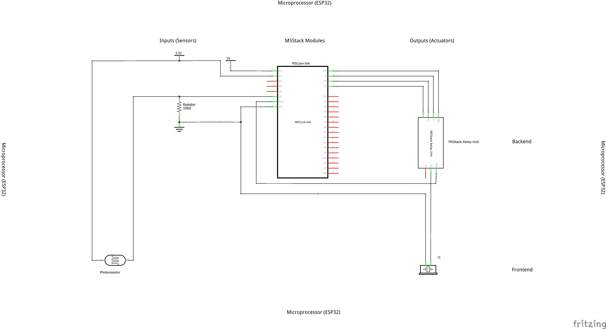

## Sun Clock Project Documentation


*by Oskar Qian*

Sun clock is a concept clock that utilize the sun light as the input data to express specific arroma at different time of the day

**Video**

<iframe width="560" height="315" src="https://www.youtube.com/embed/0kk3JEGSi1g" title="YouTube video player" frameborder="0" allow="accelerometer; autoplay; clipboard-write; encrypted-media; gyroscope; picture-in-picture" allowfullscreen></iframe>


**Image**


**Schematic Diagram**

**Code**

```
#include "M5CoreInk.h" 

const int ledPin = 10;  // built-in LED
const int sensorPin = 26;
int sensorValue = 0;
int brightnessVal = 0;
const int OutputPin = 32;
int noEmission = 0;
int currentState = noEmission;
int emission = 1;


void setup() {
  //M5.begin();
  pinMode(ledPin, OUTPUT);
  pinMode(sensorPin, INPUT);
  pinMode(OutputPin, OUTPUT);
  
  Serial.begin(9600);
}

void loop() {
  sensorValue = analogRead(sensorPin);
  Serial.print("sensorValue = ");
  Serial.println(sensorValue);
  analogWrite(ledPin, brightnessVal);
  delay(100);

  if (currentState == noEmission) {
      digitalWrite(OutputPin, LOW);

    if (sensorValue < 700)
      currentState = emission;
  }


  if (currentState == emission) {
     digitalWrite(OutputPin, HIGH);

    if (sensorValue >700 )
      currentState = noEmission;
    }
  }

```
